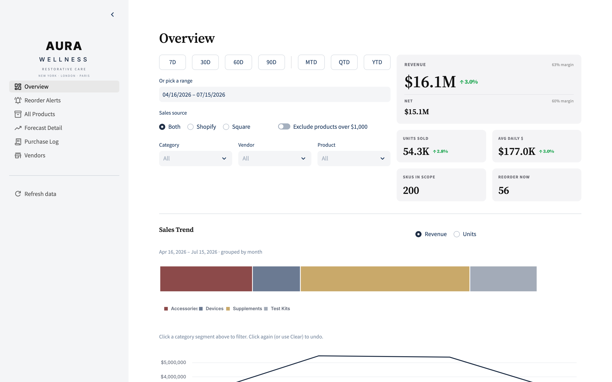
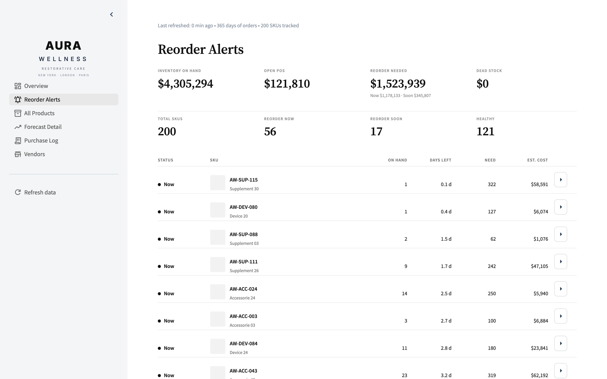
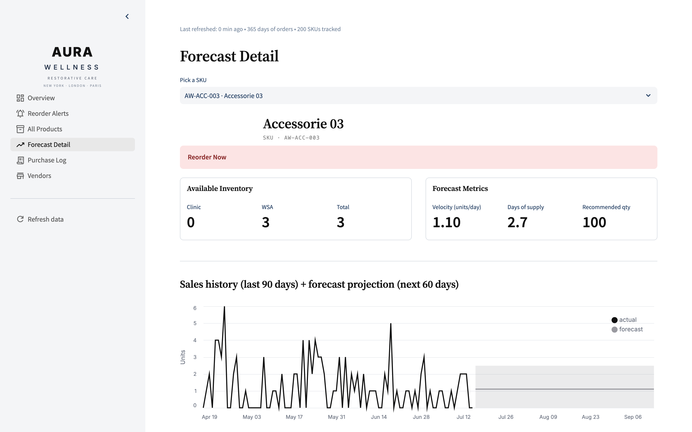

# Multi-Channel Reorder Forecasting System

A forecasting and decision tool for a multi-channel DTC wellness brand. Daily
sales from Shopify and Square are reconciled into one per-SKU view, a
recency-weighted velocity model estimates demand, and a five-state reorder
engine turns that into a prioritized purchase-order queue each morning. Built
as a Streamlit application on a normalized Postgres schema, and in production
use at the brand where I run ecommerce.

**Writeup:** [leahkatinsights.com/projects#project-04](https://leahkatinsights.com/projects.html#project-04)

## What the operator sees


Overview: revenue, units, average daily sales, SKUs in scope, and reorder count, the context around every recommendation.


Reorder alerts: the morning action queue, grouped by vendor with minimum order quantities already applied.


Forecast detail: velocity model, rolling window, days of supply, and recommended quantity side by side, so any number can be traced to its inputs.

## Headline numbers (demo dataset)

| | |
|---|---|
| 56 of 200 | SKUs flagged `reorder_now` this cycle |
| $1.18M | recommended purchase-order value, grouped by vendor with MOQ applied |
| 9.0x | velocity spread between top- and bottom-quartile SKUs |

## How it works

1. **Multi-channel sales sync.** Python pulls daily orders from the Shopify Admin API and the Square API, normalizes both into a single `(sku, date, units, revenue)` schema with a source column, and keeps 365 days of rolling history.
2. **Normalized Postgres schema.** Products, vendors, settings, purchase log, and forecast log live in a schema with foreign keys and indexes. Every SKU must have a vendor, lead time, MOQ, and unit cost, so the downstream math always has what it needs.
3. **Weighted rolling velocity.** A 90-day rolling average of daily sales per SKU, with weights ramping linearly from 0.5 (oldest day) to 1.5 (most recent), plus an optional per-SKU growth factor. Cold-start and dead SKUs are explicit cases, never silent zeros.
4. **Five-state reorder engine.** Days of supply is on-hand divided by velocity, compared against target cover days plus vendor lead time. Each SKU lands in one of `reorder_now`, `reorder_soon`, `healthy`, `slow`, or `dead`, with `on_order`, `manual_override`, and `insufficient_history` as explicit overrides. Recommended quantity covers the target window and rounds up to the vendor MOQ.

## Run it with the demo dataset

No credentials needed. `DEMO_MODE` swaps in a seeded, fictional brand ("Aura
Wellness": 200 SKUs across four categories, four vendors, 365 days of sales),
so the app renders identically on every run.

```bash
python3 -m venv .venv && source .venv/bin/activate
pip install -r requirements.txt
DEMO_MODE=1 streamlit run app.py
```

## Run it against real stores

```bash
cp .env.example .env          # Shopify, Square, and Supabase credentials
# apply schema.sql in the Supabase SQL editor
python seed_products.py       # one-time SKU seed from Shopify
streamlit run app.py
```

## Tests

```bash
python -m pytest              # 25 tests: velocity model, reorder states, demo data invariants
```

## Project layout

```
app.py              Streamlit entry point and page routing
lib/forecast.py     weighted rolling velocity model
lib/reorder.py      status logic and recommended quantity
lib/finance.py      KPI functions over recommendations and purchase log
lib/shopify.py      Shopify Admin API client (REST, no SDK)
lib/square.py       Square Orders API client, same output shape as Shopify
lib/supabase_io.py  Postgres reads and writes
lib/demo_data.py    seeded fictional dataset for DEMO_MODE
schema.sql          Postgres schema
tests/              pytest
exhibits/           screenshots used above
```

## Stack

| Layer | Tool |
|---|---|
| App | Streamlit, Altair |
| Data | Postgres on Supabase |
| Sources | Shopify Admin API, Square API |
| Modeling | pandas, numpy |
| Tests | pytest |

---

Part of the portfolio at [leahkatinsights.com](https://leahkatinsights.com).
